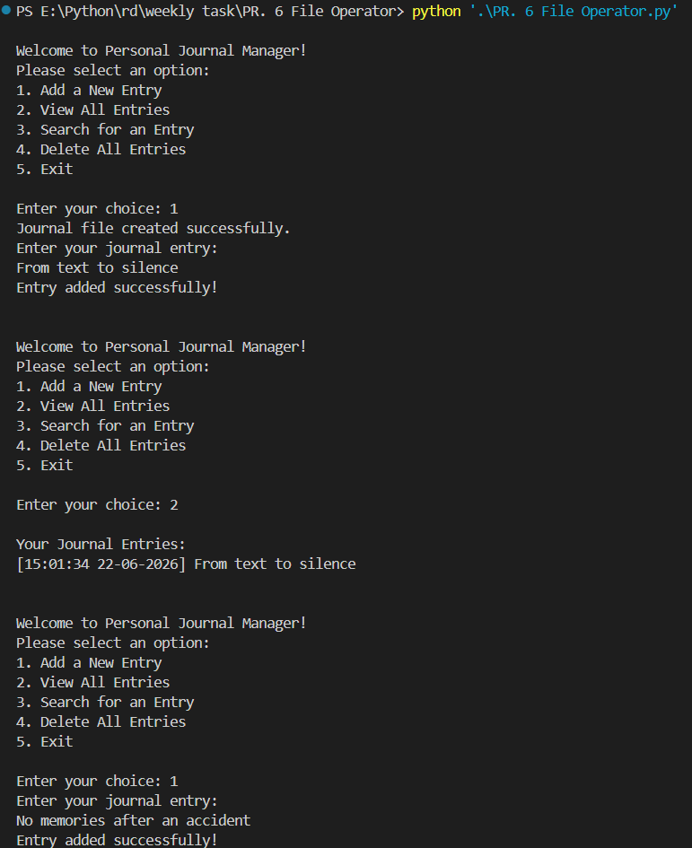
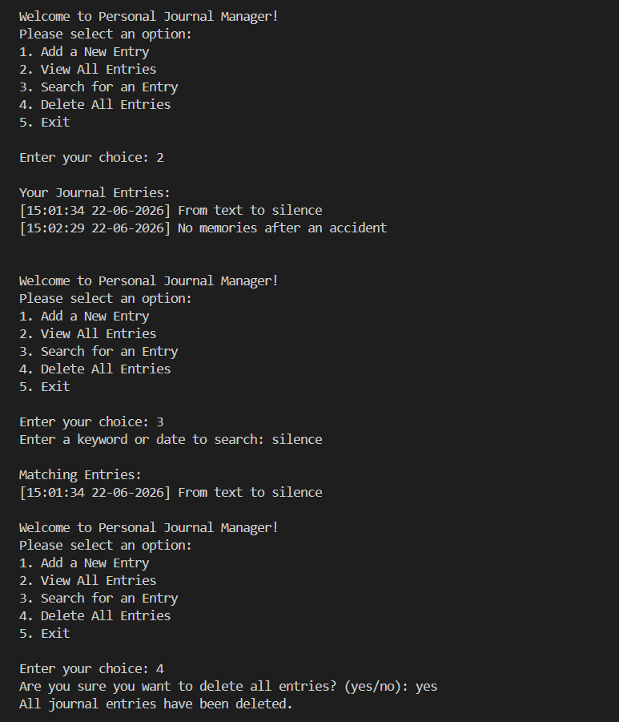
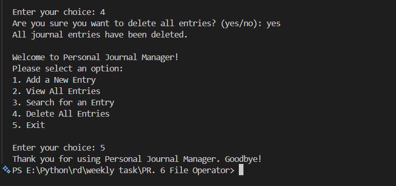

# 📓 PR. 6 File Operator — Case-by-Case Explanation

## 📌 Project Description

Interactive menu-driven Python program that allows users to manage personal journal entries using file handling operations. The project demonstrates different file modes (`x`, `a`, `r`, `w`), exception handling, object-oriented programming, searching functionality, and timestamp management in a single Python script.

The application stores journal entries in a text file and allows users to add, view, search, and delete entries directly from the terminal.

---

# 🔗 Resources

* Repository: https://github.com/patel0506/PR.-6-File-Operator
* Explanation video: https://drive.google.com/file/d/1yrzyaop2C8AQw6Ste2itMUpR_8cyxGzX/view?usp=sharing

---

# 🚀 Features

* Menu-driven interaction
* Automatic journal file creation
* Add journal entries with timestamps
* View all saved entries
* Search entries using keywords or dates
* Delete all journal entries
* File handling using multiple modes
* Exception handling for safe execution
* Object-oriented programming implementation

---

# 📂 Project Structure

```bash id="0a4q7r"
PR. 6 File Operator
├── PR. 6 File Operator.py
├── journal.txt
├── README.md
├── ss1.png
├── ss2.png
├── ss3.png
```

---

# Data structures & utilities used

* Class: `journal_manager` handles all journal-related operations.
* File Handling: Uses `x`, `a`, `r`, and `w` modes.
* Exception Handling: Prevents crashes during file operations.
* OS Module: `os.remove()` and `os.path.exists()` are used for file deletion and checking file existence.
* Date & Time: `datetime.now()` stores timestamps for journal entries.
* Lists: Used to store matching search results temporarily.
* Functions/Methods: Separate reusable logic for adding, viewing, searching, and deleting entries.

---

# 🧠 Code Explanation (summary)

The program creates and manages a text-based journal system using Python file handling concepts. Users can add journal entries with timestamps, view saved entries, search entries using keywords, and delete all entries when needed.

The project follows an object-oriented programming approach where all journal-related methods are organized inside the `journal_manager` class. Exception handling is used throughout the program to safely manage invalid operations and runtime errors.

---

# 🧾 Menu Options

* 1 — Add a New Entry
* 2 — View All Entries
* 3 — Search for an Entry
* 4 — Delete All Entries
* 5 — Exit

---

# ▶️ How the Program Works

When the program starts, it creates an object of the `journal_manager` class and continuously displays a menu using a loop. Depending on the user’s choice, the corresponding method is executed.

The application performs file operations such as creating files, appending entries, reading journal content, searching records, and deleting files. The program continues running until the user chooses the exit option.

---

# ▶️ How to Run

Run the following command from the project folder:

```powershell id="aq1p1g"
python "PR. 6 File Operator.py"
```

---

# File Handling Modes Used

## `x` Mode — Create File

Code example:

```python id="2nd2f9"
with open(self.filename, "x") as file:
    pass
```

Explanation:

1. The `x` mode is used to create a new file.

2. If the file already exists, Python raises a `FileExistsError`.

3. This mode prevents accidental overwriting of existing files.

4. In this project, `x` mode is used inside the `create_journal_file()` method to create `journal.txt` automatically if it does not already exist.

5. The `pass` statement is used because no data needs to be written immediately after file creation.

6. Example:

If `journal.txt` is missing, the program automatically creates it before adding entries.

---

## `a` Mode — Append Data

Code example:

```python id="d6h73v"
with open(self.filename, "a") as file:
    file.write(f"[{timestamp}] {entry}\n")
```

Explanation:

1. The `a` mode is used to append data to the end of a file.

2. Existing content inside the file remains unchanged.

3. New journal entries are added at the bottom of the file.

4. This mode is used inside the `add_entry()` method.

5. Every entry is saved along with its timestamp.

6. Example stored data:

```text id="6l3e59"
[14:30:22 22-06-2026] Learned Python file handling today.
```

7. Append operations are approximately O(1).

---

## `r` Mode — Read File

Code example:

```python id="49r7ie"
with open(self.filename, "r") as file:
    content = file.read()
```

Explanation:

1. The `r` mode is used to open a file for reading.

2. If the file does not exist, Python raises a `FileNotFoundError`.

3. In this project, `r` mode is used inside:

* `view_entries()`
* `search_entry()`

4. `file.read()` reads the entire content of the file.

5. `file.readlines()` reads the file line-by-line into a list.

6. Example:

```python id="vok3ma"
lines = file.readlines()
```

7. Reading operations take O(n) time where `n` is the file size.

---

# Class and Constructor Explanation

## Class Definition

Code:

```python id="2dddf3"
class journal_manager:
```

Detailed explanation:

1. The `journal_manager` class groups all journal-related operations into a single structure.

2. Using a class improves code organization and readability.

3. Every method inside the class performs a specific operation such as adding, viewing, searching, or deleting journal entries.

4. This project follows the object-oriented programming approach.

---

## Constructor (`__init__`)

Code:

```python id="z0g8h0"
def __init__(self, filename="journal.txt"):
    self.filename = filename
```

Detailed explanation:

1. The constructor runs automatically when an object of the class is created.

2. `self.filename` stores the journal filename.

3. By default, the filename is `journal.txt`.

4. This avoids repeating the filename multiple times in the program.

5. Example:

```python id="7lhb2g"
journal = journal_manager()
```

This creates an object linked to `journal.txt`.

---

# Case 1 — Add a New Entry

Code:

```python id="a0s9yo"
entry = input("Enter your journal entry:\n")
timestamp = datetime.now().strftime("%H:%M:%S %d-%m-%Y")

with open(self.filename, "a") as file:
    file.write(f"[{timestamp}] {entry}\n")
```

Detailed explanation:

1. User Input:

The program asks the user to enter a journal entry.

Example:

```text id="pn86yv"
Today I completed my Python project.
```

2. Timestamp Generation:

```python id="9j8z1n"
datetime.now().strftime("%H:%M:%S %d-%m-%Y")
```

* `datetime.now()` gets the current system date and time.
* `strftime()` formats the timestamp.

Example:

```text id="g8p18y"
15:40:12 22-06-2026
```

3. Append Mode:

The file is opened using append mode (`a`) so new data is added without deleting old entries.

4. Writing Data:

```python id="m6quj2"
file.write(f"[{timestamp}] {entry}\n")
```

The journal entry is stored in the following format:

```text id="8o6u3u"
[15:40:12 22-06-2026] Today I completed my Python project.
```

5. Exception Handling:

Handles:

* `PermissionError`
* unexpected runtime errors

6. Complexity:

Appending data to a file is approximately O(1).

---

# Case 2 — View All Entries

Code:

```python id="3n99tm"
with open(self.filename, "r") as file:
    content = file.read()
```

Detailed explanation:

1. The file is opened using read mode (`r`).

2. `file.read()` loads the complete journal content into memory.

3. The program checks whether the file is empty:

```python id="s2f9x0"
if content.strip():
```

4. If entries exist, they are displayed.

Example output:

```text id="6j6wbt"
Your Journal Entries:
[10:20:11 20-06-2026] Had a productive day.
[08:11:45 21-06-2026] Learned exception handling.
```

5. If the file is empty, the user is informed.

6. Exception Handling:

Handles:

* `FileNotFoundError`
* `PermissionError`
* unexpected runtime errors

7. Complexity:

Reading the file takes O(n), where `n` is the file size.

---

# Case 3 — Search for an Entry

Code:

```python id="w0p3u9"
keyword = input("Enter a keyword or date to search: ")

with open(self.filename, "r") as file:
    lines = file.readlines()

matches = []

for line in lines:
    if keyword.lower() in line.lower():
        matches.append(line)
```

Detailed explanation:

1. The user enters a keyword or date.

Example:

```text id="i8p7y8"
Python
```

2. The file is opened in read mode.

3. `readlines()` stores every journal entry as a list element.

Example:

```python id="v78e34"
[
 "[10:20] Learned Python\n",
 "[11:30] Went outside\n"
]
```

4. Case-insensitive search:

```python id="zw0v4x"
keyword.lower() in line.lower()
```

* Converts both strings to lowercase.
* Ensures matching works regardless of uppercase/lowercase letters.

5. Matching entries are stored inside the `matches` list.

6. If matches exist, they are displayed.

Example output:

```text id="h3l0qx"
Matching Entries:
[10:20] Learned Python
```

7. If no matches exist, the user receives an informative message.

8. Complexity:

Searching takes O(n), where `n` is the number of lines in the file.

---

# Case 4 — Delete All Entries

Code:

```python id="36q10t"
if confirm == "yes":
    os.remove(self.filename)
```

Detailed explanation:

1. File Existence Check:

```python id="v2j4sx"
if not os.path.exists(self.filename):
```

Checks whether the journal file exists before deletion.

2. Confirmation Prompt:

```python id="9ksf2u"
confirm = input("Are you sure you want to delete all entries? (yes/no): ")
```

Prevents accidental deletion.

3. File Deletion:

```python id="rwrp3m"
os.remove(self.filename)
```

Permanently deletes the journal file from the system.

4. Cancellation Handling:

If the user enters anything other than `"yes"`, deletion is cancelled safely.

5. Exception Handling:

Handles:

* `PermissionError`
* unexpected runtime errors

6. Complexity:

Deleting a file is approximately O(1).

---

# Main Function Explanation

Code:

```python id="m8zhfx"
def main():
    journal = journal_manager()

    while True:
```

Detailed explanation:

1. Object Creation:

```python id="bxvq7g"
journal = journal_manager()
```

Creates an object of the `journal_manager` class.

2. Infinite Loop:

```python id="uz2n7i"
while True:
```

Continuously displays the menu until the user exits.

3. Menu Display:

The user selects an option from 1 to 5.

4. Conditional Execution:

Different methods are called depending on the selected option.

Example:

```python id="sghw54"
if choice == 1:
    journal.add_entry()
```

5. Exit Condition:

```python id="4dbe3j"
elif choice == 5:
    break
```

Stops the loop and exits the program.

6. Input Validation:

```python id="2s3b1e"
except ValueError:
```

Handles invalid numeric input safely.

---

# Exception Handling Used

## `FileNotFoundError`

Code:

```python id="f0m1j5"
except FileNotFoundError:
```

Explanation:

Occurs when the file does not exist while reading or searching.

---

## `PermissionError`

Code:

```python id="7x10cw"
except PermissionError:
```

Explanation:

Occurs when the program does not have permission to access the file.

---

## Generic Exception

Code:

```python id="y62a7y"
except Exception as e:
```

Explanation:

Handles unexpected runtime errors and prevents program crashes.

---

# Learning Outcomes

After completing this project, the following concepts were successfully implemented:

✅ File Handling

✅ File Modes (`x`, `a`, `r`, `w`)

✅ Classes and Objects

✅ Constructors

✅ Exception Handling

✅ OS Module

✅ Date and Time Formatting

✅ Searching Data

✅ Menu-Driven Programming

✅ Object-Oriented Programming

---

# Example outputs with screenshots

These screenshot examples were captured from the program run.

### ss1



### ss2



### ss3


